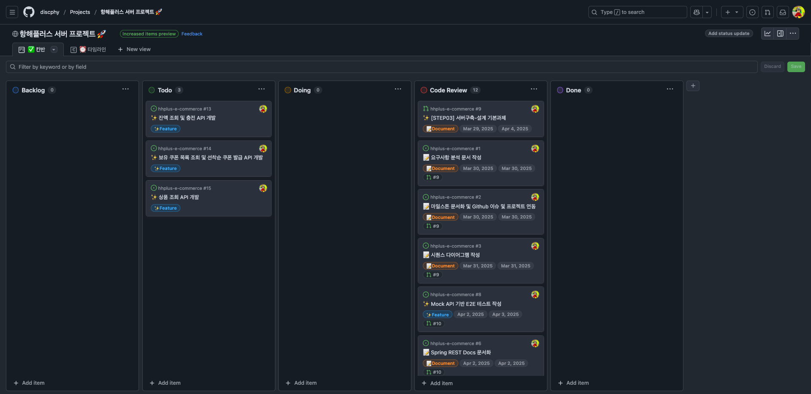
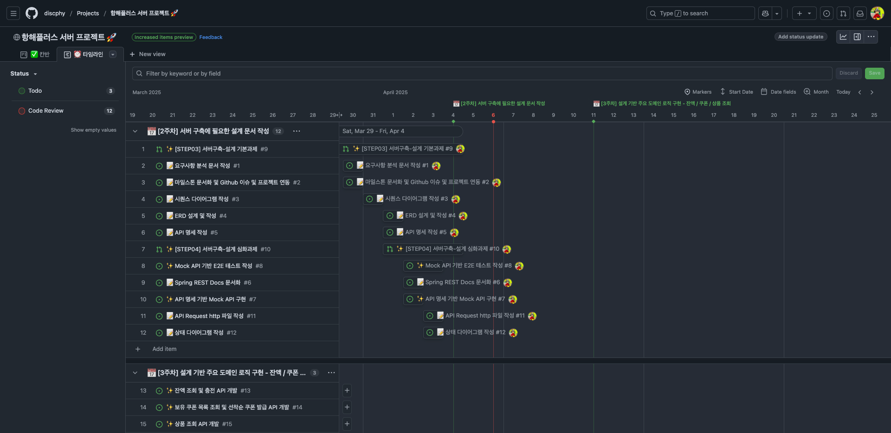
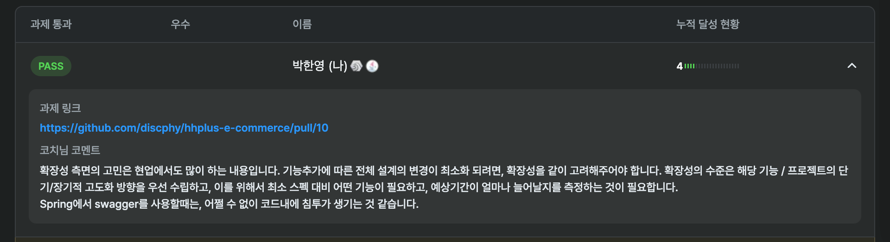
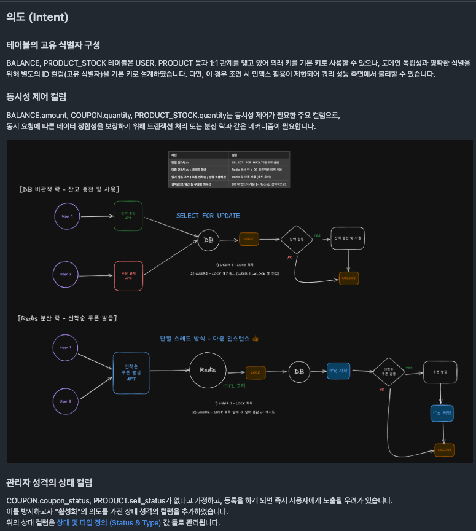
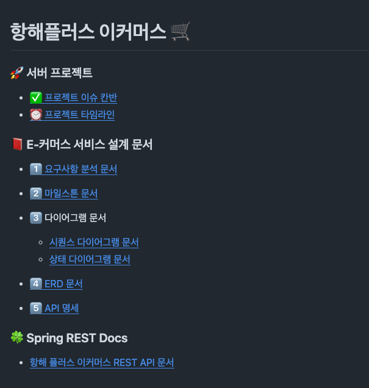

# 항해 플러스 2주차 - 이커머스 아키텍처 설계 

## ❓ 설계 없이 코드를 작성한다?

먼저 답부터 하자면,  
비즈니스의 규모에 따라 설계의 깊이나 범위는 달라질 수 있지만, **결국 설계를 피할 수는 없다. 🏹**

이번 주차의 과제는 "**서버 구축 설계**" 단계이다.  

되돌아보면, 실무에서 "**서버 구축 설계**"를 제대로 해본 경험은 없는 것 같다. 😅

설계를 한다면, “**ADD(API Driven Development)**” 방식으로 진행하고,
그에 맞춰 API 명세서를 작성한 뒤 바로 기능 구현에 들어가는 경우가 많았다.

빠르게 배포를 해야 하는 업무 특성 상 어쩔 수도 없다고 생각하지만,   
내가 생각하는 설계와는 거리가 멀다. ️

이번 2주차 발제도 1주차와 마찬가지로 허재 코치님께서 진행해주셨고,   
설계에 대한 중요성을 언급해주시면서, 명언을 남기셨다. 

```text
설계가 명확하면, "코드를 치는 행위"는 목표를 달성하는 "수단"이 된다.
설계가 명확하지 않으면, "코드를 치는 행위"는 불필요한 "노동"이 된다.
```

완전 공감한다... (~~솔직히 조금 뜨끔했다...~~)   
설계를 건너뛰고 개발을 하다 보면, 어느 순간 "**내가 지금 무슨 개발을 하고 있는 거지…?**"라는 생각이 들 때가 정말 많다. 🤔

이런 경험이 있었기에,   
요즘은 요구사항을 받자마자 코드를 작성하기보다는,  
요구사항을 정리하고, 구체화 과정을 거쳐 **설계에 충분한 시간**을 들이려 노력하고 있다. ⏳

자, 그럼 이번 주차의 과제를 살펴보자.

## 🧱 아키텍처 설계, 어디정도높이까지올라가는거예요?


아래는 내가 이번 주차에 진행했던 설계 과정이다.    
직접 해본 설계도 있었지만, 대부분은 생소하고 처음 시도해보는 설계들이었다.

👉 [[STEP03] 서버구축-설계 기본과제 PR](https://github.com/discphy/hhplus-e-commerce/pull/9)  
👉 [[STEP04] 서버구축-설계 심화과제 PR](https://github.com/discphy/hhplus-e-commerce/pull/10)

### 🍀 진행 과정
+ 기능/비기능 요구사항 분석 
+ 마일스톤 작성 
+ 시퀀스 다이어그램 작성 
+ 상태 다이어그램 작성 
+ ERD 작성 
+ API 명세서 작성
+ Mock API 구현
+ API 문서화 (Spring REST Docs)
+ API E2E 테스트 코드 작성

> GitHub에 마일스톤을 생성하고 칸반, 타임라인 보드로 구성하니 꽤나 볼만했다. 




### ⭐️ 설계 중요 포인트

과제들을 진행하면서 가장 중요하게 생각한 설계는 요구사항 분석 단계였다. 

#### 📌 요구사항 분석

요구사항을 제대로 분석하지 않으면 **비용**과 **시간**이 낭비되며,  
추가 기능으로 인한 **객체 간의 책임이 불분명해지고 강결합**이 발생하기 때문에   
특히 집중해서 진행했다.

그래서 최대한 요구사항들을 **구체화**하려고 노력했다.
여기에서 이야기하는 "**구체화**"는 다음과 같다.

##### ❓구체화란
말 그대로 추상적인 개념을 구체적으로 표현하는 것이다.  
다음은 내가 작성한 구체화의 예시이다.

```text
추상 : 친구랑 생일파티를 했어.
구체 :
 - 모일 시간을 정이 두터운 사람들과 정한다.
 - 정한 시간에 맞추어 장소를 정하고 예약한다.
 - 예약한 장소를 정이 두터운 사람들에게 문자를 통해 알려준다.
 - 모일 시간과 예약한 장소에서 정이 두터운 사람들과 만남을 가진다.
 - 만남한 장소에서, 입으로 씹는 행위와 입으로 소리를 내는 행위를 하며 시간을 보낸다.
 - 케이크와 선물을 통해 정이 두터운 사람들에게 축하를 받는다.
 
추상 : 백엔드 기능을 개발했어.
구체 : 
 - 기능에 대한 요구사항을 파악한다.
 - 요구사항을 확인하고 마일스톤을 작성한다.
 - 요구사항에 맞는 시나리오 설계 문서를 작성한다. (UseCase, 시퀀스 다이어 그램)
 - ERD를 설계 및 작성한다.
 - API 명세 및 Mock API를 구현한다.
 - TDD를 통해 단위 테스트 및 주요 비지니스 로직을 개발한다.
 - 통합 테스트 코드를 작성한다.
 - PR을 올리고, 코드리뷰를 받으며 리팩토링을 진행한다.
```

이런 식으로 추상적인 개념을 구체화하는 과정을 통해, 기능을 최대한 펼쳐 요구사항을 뾰족하게 분석하고자 노력했다.

#### 📌 확장성 측면에 대한 고려

이 단계에서 나는 가장 많은 시간을 투자했다.
> 멘토링 청강을 많이 다녔는데, 이것저것 개념이 섞이면서 설계를 계속 변경했던 것 같다. 😂

##### 🆚 최소 스펙 VS 확장성

_"요구사항에만 만족하는 최소스펙으로 설계를 해야 하는지.."_  
_"확장성 측면의 고려해 설계를 해야 하는지.."_

이 부분에 대해서 가장 많이 고민했었다.  

그렇지만 "**항해 플러스**"의 과제 제출에 대한 목표보다도,  
현업에서의 설계 역량을 키우는 것을 더 우선시했기 때문에  
결국 후자를 선택하였다.

해당 내용과 관련해서 PR에 "리뷰 받고 싶은 내용"을 작성하였고,   
여기에 대한 피드백을 코치님께서 해주셨다.  



실제 현업에서도 중요한 포인트이며, 그 중요성을 강조해주신 것 같았다.   
차후에 현업에서도 이와 같은 생각을 가지고 설계를 진행하면 더 나은 기능과 프로젝트 결과물로 이어질 수 있을 것 같다.

하지만, 위의 고민에 대한 해소를 만끽함과 동시에... 더 큰 고민이 도래되었다.

##### 🆚 주문 결제 도메인 통합? 분리? 

_"주문 결제 도메인 통합이 맞을지... 분리가 맞을지..."_

코치님들도 해당 부분에 대해서 의견이 조금 갈렸던 것 같다. (그래서.. 더.. 헷갈렸다... 😂)

사실 정답은 없지만, 그럼에도 답을 찾으려 많이 고민했다.   
결국엔 "주문 결제 도메인 통합"으로 설계를 진행했다. 

차후에 개발을 하면서 분리를 할 수도 있겠지만,  
당시엔 분리가 오히려 오버 엔지니어링일 수 있다는 판단으로 통합하기로 했다.  
(주문이 결제에 대한 책임을 갖는 것이 맞는가... 생각해보면 “분리”가 더 맞지 않았을까 싶기도 하다. 🤔)

특히, ERD를 설계하는 과정에서는 확장성을 고려한 설계를 진행하면서,   
설계 의도를 문서로 정리해 추가로 남기기도 했다.   



> "[엑스칼리드로우](https://excalidraw.com/)"를 이때 처음 써봤는데 너무 편하고 좋은 것 같다. 🎨  
> (이런 툴이 있었구나... 😳)

마지막으로, "Spring REST Docs"를 [Github Page](https://discphy.github.io)에 배포하며 이번 주차를 마무리했다.



설계가 중요하다는 걸 알고 있음에도,   
과정이 복잡하고 머리가 아파서 빨리 코드를 작성하고 싶다는 생각이 자주 들었다. 

하지만, 명심해야 한다...  
설계가 귀찮아질 때는 "허재" 코치님의 명언을 되새겨야 할 필요가 있다. 😂  
```text
"설계가 명확하지 않으면, "코드를 치는 행위" 는 불필요한 "노동" 이 된다." - 허재
```

다음 주차부터는, 작성한 설계를 기반으로 클린 아키텍처 구조에서 비즈니스 로직 개발과 단위 테스트를 진행할 예정이다.     
생소한 구조이지만, 새로운 패턴을 접한다는 점에서 설레기도 한다.

```bash
# 미리보는 패키지 구조
com.example
├── interfaces                 # 외부 요청을 받는 계층 (Controller, DTO 등)
│   └── point
│       ├── PointController
│       ├── PointRequest       # Request DTO
│       └── PointResponse      # Response DTO
├── application                # 비즈니스 유스케이스 조합 계층 (Facade, ApplicationService 등)
│   └── point
│       └── PointFacade
├── domain                     # 핵심 도메인 로직 계층 (엔티티, 서비스, 도메인 규칙 등)
│   └── point
│       ├── Point              # ⭐️ 도메인 엔티티
│       ├── PointType          # 포인트 종류 Enum
│       ├── PointCommand       # 도메인 요청 VO
│       ├── PointInfo          # 도메인 응답 VO
│       ├── PointService       # 도메인 서비스
│       └── PointRepository    # 도메인 리포지토리 인터페이스
└── infrastructure             # 외부 시스템 구현 계층 (DB, 외부 API 연동 등)
    └── point
        └── PointRepositoryImpl # JPA 구현체
```

그럼 3주차도 화이팅..!! 🏃

[출처]
+ 항해 플러스 : https://hanghae99.spartacodingclub.kr/plus/be

