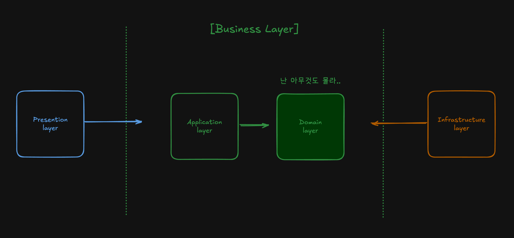
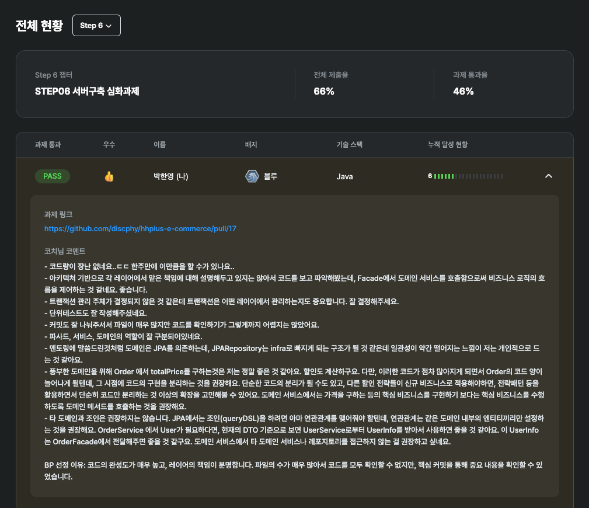

# 항해 플러스 3주차 - 클린 레이어드 아키텍처

## 🙋‍♂️ 클린 레이어드 아키텍처가 뭐죠...?

클린 레이어드 아키텍처(Clean Layered Architecture)는 
계층형 아키텍처(Layered Architecture)와 클린 아키텍처(Clean Architecture)의 개념을 통합한 구조이다. 

즉, 계층형 구조에서 의존성 역전(DIP, Dependency Inversion Principle)을 통해 도메인을 가장 중심에 두는 것이다.  
각 레이어들의 책임이 존재하며, **도메인 레이어**는 어떤 레이어도 모르는 것이 핵심이다.

나는 클린 레이어드 아키텍처를 처음 들어 봤기 때문에, 이해하기 쉽지 않았다.

__아래 이미지는, 클린 레이어드 아키텍처를 이해하기 위해 그린 그림이다. 😂__



## 🧱 클린 아키텍처 레이어 구조

### 📌 프레젠테이션 레이어 (Presentation Layer)

**HTTP 요청과 응답을 처리하는 레이어로, 외부 요청을 받아 Application Layer 에 전달하고, 결과를 반환한다.**

+ 역할 : HTTP 요청을 받고 응답 반환
+ 구성 : @RestController, @Controller
+ 책임 : 사용자 입력 검증, API 응답 포맷 변환, 요청 파라미터 매핑 
+ 의존 대상 : Application Layer

#### 패키지 및 클래스 네이밍

| 패키지명         | 클래스             | 요청 DTO       | 응답 DTO        |
|--------------|-----------------|--------------|---------------|
| `interfaces` | `XxxController` | `XxxRequest` | `XxxResponse` |

#### 레이어 패키지 구조 (주문 도메인 예시)

```text
interfaces
└── order
    ├── OrderController.java    # 주문 컨트롤러
    ├── OrderRequest.java       # 요청 DTO
    └── OrderResponse.java      # 응답 DTO
```

#### Controller 클래스 예시

```java
@RestController
@RequiredArgsConstructor
public class OrderController {

    private final OrderFacade orderFacade;  // 주문 파사드 주입

    @PostMapping("/api/v1/orders")
    public ApiResponse<OrderResponse> createOrder(@RequestBody OrderRequest request) {
        OrderResult orderResult = orderFacade.createOrder(OrderCriteria.of(request)); // 주문 파사드 호출
        return ApiResponse.success(OrderResponse.of(orderResult)); // 응답 DTO 변환
    }
}
```

### 📌 애플리케이션 레이어 (Application Layer)

**도메인 서비스들을 조합하여 비지니스 로직을 처리하는 레이어로, 트랜잭션 제어와 흐름 제어에 관여한다.**

+ 역할 : 유즈케이스 실행 및 트랜잭션 관리
+ 구성 : @Service, Facade
+ 책임 : 프레젠테이션 레이어와 도메인 레이어 간 연결, 트랜잭션 단위 관리, 여러 도메인 서비스 호출
+ 의존 대상 : Domain Layer

#### 패키지 및 클래스 네이밍

| 패키지명          | 클래스         | 요청 DTO        | 응답 DTO      |
|---------------|-------------|---------------|-------------|
| `application` | `XxxFacade` | `XxxCriteria` | `XxxResult` |


#### 레이어 패키지 구조 (주문 도메인 예시)

```text
application
└── order
    ├── OrderCriteria.java    # 요청 DTO
    ├── OrderResult.java      # 응답 DTO
    └── OrderFacade.java      # 주문 파사드
```

#### Facade 클래스 예시

```java
@Service
@RequiredArgsConstructor
public class OrderFacade {

    private final OrderService orderService; // 주문 도메인 서비스 주입
    private final PaymentService paymentService; // 결제 도메인 서비스 주입

    @Transactional
    public OrderResult createOrder(OrderCriteria criteria) {
        Order order = orderService.createOrder(criteria.toCommand()); // 주문 도메인 서비스 호출
        paymentService.payment(order); // 결제 도메인 서비스 호출
        return OrderResult.of(order); // 응답 DTO 변환
    }
}
```

### 📌 도메인 레이어 (Domain Layer)

**비즈니스 로직을 처리하는 레이어로, 도메인 모델과 도메인 서비스를 포함한다.**

+ 역할 : 비즈니스 로직 처리
+ 구성 : Domain Model, Domain Service, Domain Repository, Enum, VO
+ 책임 : 도메인 모델과 도메인 서비스 구현 / 도메인 객체 간의 협력 및 책임 / 상태 관리
+ 의존 대상 : 없음 ❌

#### 패키지 및 클래스 네이밍

| 패키지명     | 클래스          | 요청 DTO       | 응답 DTO    |
|----------|--------------|--------------|-----------|
| `domain` | `XxxService` | `XxxCommand` | `XxxInfo` |

#### 레이어 패키지 구조 (주문 도메인 예시)

```text
domain
└── order
    ├── Order.java              # 주문 도메인 객체
    ├── OrderCommand.java       # 요청 DTO
    ├── OrderInfo.java          # 응답 DTO
    ├── OrderProduct.java       # 주문 상품 도메인 객체
    ├── OrderRepository.java    # 주문 도메인 레포지토리 인터페이스
    ├── OrderService.java       # 주문 도메인 서비스
    └── OrderStatus.java        # 주문 상태 Enum
```

#### 도메인 서비스 예시

```java
@Service
@RequiredArgsConstructor
public class OrderService {

    private final OrderRepository orderRepository; // 주문 도메인 레포지토리 주입

    public Order createOrder(OrderCommand command) {
        Order order = Order.create(command.getProducts()); // 주문 도메인 객체 생성
        return orderRepository.save(order); // 주문 도메인 레포지토리 저장
    }
}
```

### 📌 인프라 레이어 (Infrastructure Layer)

**외부 시스템과의 연동을 처리하는 레이어로, 데이터베이스와의 연동, 외부 API 호출 등을 처리한다.**

+ 역할 : 외부 시스템과의 연결
+ 구성 : @Repository, JPA/MyBatis/QueryDSL, 외부 API 호출, 메시지 큐 등
+ 책임 : DB 연동, 외부 API 호출, 파일, Redis, Kafka
+ 의존 대상 : Domain Layer 인터페이스 구현

#### 레이어 패키지 구조 (주문 도메인 예시)

```text
infrastructure
└── order
    ├── repository
    │   ├── OrderJpaRepository.java         # JPA 레포지토리
    │   ├── OrderQueryDslRepository.java    # QueryDSL 레포지토리
    │   └── OrderRepositoryImpl.java        # 레포지토리 구현체
    ├── client
    │   └── OrderClientImpl.java            # 외부 API 호출
    └── message
        └── OrderMessageSenderImpl.java     # 메시지 큐
```

#### 레포지토리 구현체 예시

```java
@Component
@RequiredArgsConstructor
public class OrderRepositoryImpl implements OrderRepository {
    
    private final OrderJpaRepository orderJpaRepository; // JPA 레포지토리 주입
    
    public Order save(Order order) {
        return orderJpaRepository.save(order); // JPA 레포지토리 저장
    }
}
```

## ⏮️ 과제 Rollback

과제 제출 2일 전, 나는 작성했던 브랜치를 날려버리고 새로 작성했다.

이유는, 과제 제출 이틀 전   
클린 아키텍처에 대한 깨달음을 오전 중에 혼자 깨달았고,
오후 멘토링 시간 이후에 확신을 가졌다.

주어진 시간이 단 이틀이라... 연차를 사용할 수 밖에 없었다.  
이전에 작성했던 문제점은 다음과 같다. 

```text
- 저수준 모듈이 고수준 모듈을 의존
- 도메인 클래스 간의 강결합
- 도메인 클래스의 관심사의 분리 부족
- 도메인 클래스의 책임이 불명확
```

즉, DIP와 객체지향 사이에서 혼란이 왔던 것 같다.  
위의 문제를 해결하기 위해, 리팩토링으로는 어려운 부분이 많았고, 고민은 많았으나, 결국 새로 작성하기로 했다.

다시 과제를 수행하면서, 고민했던 부분은 다음과 같다.

## 💭 과제 고민했던 부분

### 📌 도메인 간 협력? or 강결합?

다음은 주문 도메인 클래스에 쿠폰을 적용하는 예시이다. 

인자 값으로 쿠폰 ID를 받는게 좋을지? 
```java
class Order {

    private Long couponId; 

    private Order(Long couponId) {
        this.couponId = couponId;
    }
}
```

인자 값으로 쿠폰 도메인 자체를 받는게 맞을지? 
```java
class Order {

    private Long couponId; 

    private Order(Coupon coupon) {
        this.couponId = coupon.getId(); 
    }
}
```

코치님들 사이에서도 의견이 분분한 내용이다. 
은탄환은 없지만, 내 개인적인 생각은.. 객체지향 적이기 때문에 둘 중 아래의 예시처럼 작성하는 것이 좋다고 본다.
Order와 Coupon의 관심사는 어느정도 있다고 생각해서 협력이 필요해보이며,  
couponId를 받는 것은 어떤 Long 타입을 받아도 검증이 되지 않기 때문에 선호하지는 않는다. 

단, 쿠폰 도메인을 받았을 때는 쿠폰의 메서드를 사용 시 잘 적절하게 책임을 분리하여 사용해야 한다. 
예를 들면, 쿠폰 도메인의 발행이라는 메서드를 주문 도메인에서 사용한다면, 쿠폰 도메인에 대한 의존성이 생기기 때문에 좋지 않다.

이러한부분 때문이라도, 도메인 클래스와 엔티티 클래스를 구분하는 게 좋을 것 같다. 대신, 잘 구현해야한다.
(보통은 도메인 클래스와 엔티티 클래스를 동일시 한다고 한다.)

근데 도메인 클래스에 ID 식별자만 가지고 있으면 객체 지향이 아닌 클래스가 너무 테이블 지향적인 것 같다. 

### 📌 레이어 간 DTO -> 오버 엔지니어링?

DTO를 레이어 별로 나누는 것이 오버 엔지니어링이 아닌가?
DTO를 레이어 별로 나누는 이유는 각 레이어의 책임을 명확히 하기 위함이다.

또한, 완충제의 역할로서 레이어 간의 의존성을 줄여준다.

예를 들어 프레젠테이션 레이어에서 도메인 레이어의 DTO를 그대로 사용하게 되면, API 스펙이 변경될 때마다 혹은 버저닝 될 때마다 도메인 레이어의 DTO도 변경해야 한다. 
이렇게 되면 도메인 레이어가 프레젠테이션 레이어에 의존하게 되어, 레이어 간의 결합도가 높아진다.

이런 경우, 프레젠테이션 레이어에서 도메인 레이어의 DTO를 사용하지 않고, 
프레젠테이션 레이어 전용 DTO를 사용하면 API 스펙이 변경되더라도 도메인 레이어는 영향을 받지 않게 된다.

지금 당장은 DTO를 레이어 별로 나누는 것이 오버 엔지니어링처럼 느껴질 수 있지만, 
유지보수 측면에서는 도메인 레이어와 프레젠테이션 레이어 간의 결합도를 낮추는 것이 좋다.

### 📌 파사드 패턴 꼭 써야 할까?

결론부터 말하자면, 파사드 패턴은 "울며 겨자먹기"로 사용하는 것이다.

파사드 패턴이란? 복잡한 서브시스템을 하나로 감싸서 외부에서 쉽게 사용할 수 있도록 만드는 패턴이다.
도메인 서비스는 하나의 도메인에 대한 비즈니스 로직을 처리하는 서비스이므로, 다른 도메인에 관여를 할 수 없기 때문에
도메인 서비스가 여러 개를 결합해서 사용할 때, 도메인 서비스 간의 의존성을 줄이기 위해 파사드 패턴을 사용한다.

하나의 도메인 서비스만 사용할 경우, 파사드 패턴을 사용하지 않아도 된다. 오히려 불필요한 파일들이 생겨 복잡도가 증가할 수 있다.

또한, 요청 DTO 의 네이밍을 `Criteria` 로 사용하였는데 조금 모호한 것 같다. (~~Criteria 는 조회 시 사용하는 네이밍 같다.~~)

> Facade의 단어 뜻은 건축물의 정면을 의미한다.  
> Facade 클래스 하나만 보면 전체 흐름을 파악할 수 있다라는 의미에서 사용한 것 같다. 

### 📌 코드의 비중 중 검증 로직이 80퍼?

코드를 작성해보면 알겠지만, 코드의 비중 중 검증 로직이 약 80%를 차지한다.
이런 경우, 검증 로직을 도메인 서비스에 두는 것이 좋을지? 도메인 요청 DTO에 두는 것이 좋을지? 아니면 도메인 객체에 두는 것이 좋을지?

나는 개인적으로 도메인 객체에 두는 것을 선호한다.

물론 Command 객체인 요청 DTO에 두는 것도 Early Validation 이라는 점에서 합리적 일 수 있다. 
하지만, 위 구조는 요청 DTO마다 검증 로직을 두어야 하기 때문에 중복이 발생할 수 있다. 또한 DTO에 대한 단위 테스트는 잘 작성하지 않는 편이기 때문에 
요청 DTO에 검증 로직을 둔다고 해도, 도메인 객체에도 검증 로직을 두어야 한다고 생각한다.

### 📌 도메인 클래스와 JPA 엔티티 클래스간의 분리해야 될까? 

많은 회사들이 도메인 클래스와 JPA 엔티티 클래스를 구분하지 않고 사용하고 있는 것으로 알고 있다.
하지만, 나는 구분하는 것이 좋다고 생각한다.

선호하지 않는 이유는 다음과 같다. 

1. 도메인 클래스가 JPA에 의존적이게 된다. 차후에 사용하지 않게 될 경우, 도메인 클래스를 변경해야 한다.
2. 객체간의 협력할 때, 도메인 간의 협력이 아닌 식별자 만으로 협력하게 된다. (연관관계를 맺지 않으면 별도 @Transient 어노테이션을 사용해야 한다.)
3. infrastructure 레이어에 의존하게 된다. (DIP 위배? 엔티티 클래스가 도메인 레이어에 있으면 구현체도 도메인 레이어에 있어야 될 것 같은...)
4. 도메인 클래스의 관심사가 분리되지 않는다. (도메인 클래스가 테이블스러워 진다.)

그런데 만약 분리를 한다면, 잘 작성해야 될 것이다. 어설프게 작성하면 독이 될 수 도 있다.

이번 과제에서 분리를 하려면 코치님 보다 코드를 잘 짜야 된다는(?) 조건이 있었기 때문에 JPA 엔티티 클래스를 도메인 클래스로 작성했지만,
나중에 리팩토링을 해 볼 생각이다. (더 좋은 디자인이지 않을까라는 생각.. )

### 📌 JPA 연관관계는 최소화 해야될까?

JPA 생명 주기가 같거나,  




연관관계를 최소화 했지만, 이게 맞나 싶었다.
예를 들면, 특정 도메인에서 다른 도메인의 식별자를 가지고 있을 때 인스턴스 시에 도메인을 직접 받아야 하는 게 맞는 게 아닌지..?
식별자만 받으면 정합성이 깨지지 않을까?

또한 라이프 사이클이 같은 도메인인 경우는 연관관계를 구성해도 될 것 같으며,
이력 관리를 하는 도메인의 경우는 또 연관관계를 잘 쓰지 않는다.
왜냐하면 메인 테이블과 이력 테이블을 조인해서 조회하는 기능은 잘 없기 때문이다.

또한, 도메인 클래스를 엔티티 클래스와 동일시 한다고 해서 데이터 관점으로 도메인 객체를 바라보면 안된다. 


