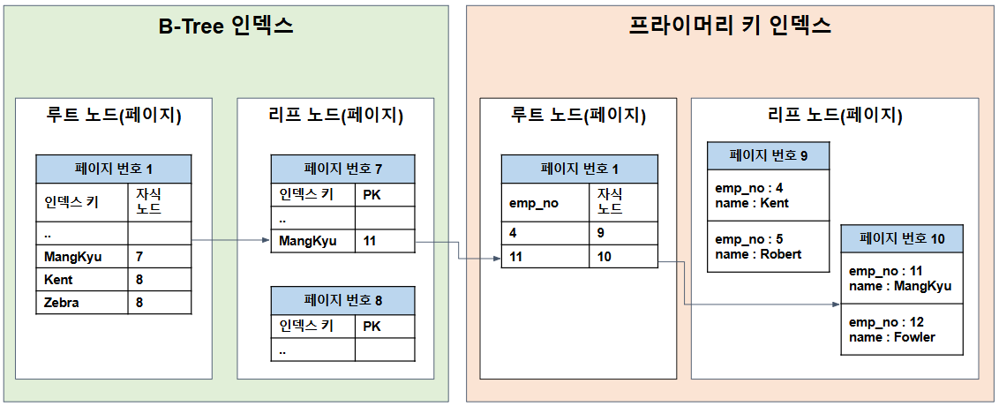

# 항해 플러스 백엔드 8기 4주차 - DB 인덱싱 최적화 

## 💡 WIL 보다는 복습 

항해 4주차는 이미 지나 수료도 완료되었다.  
이번 글은 회고보다는 4주차에 진행했던 발제와 과제를 복습하는 느낌으로, 내 언어로 정리하고 학습하기 위한 목적에 가깝다.

## ⚡️ 트랜잭션이란?

하나의 작업 단위를 의미하며, 모든 작업이 전부 성공하거나 전부 실패해야 하는 원자적 연산을 뜻함.   
일반적으로 DB 트랜잭션을 지칭하지만, CS 전반에서 사용되는 개념이다.

### 📌 ACID - 트랜잭션 4가지 특징

+ **원자성(Atomicity)**: 트랜잭션 내 모든 작업은 전부 성공하거나, 전부 실패해야 한다. 
+ **일관성(Consistency)**: 트랜잭션 수행 전후로 시스템의 상태는 일관성을 유지해야 한다.
+ **격리성(Isolation)**: 동시에 실행되는 트랜잭션은 서로 간섭하지 않아야 한다.
+ **지속성(Durability)**: 트랜잭션이 성공적으로 완료되면, 시스템 장애가 발생하더라도 그 결과는 보존되어야 한다.

## ✨ DB 트랜잭션 

데이터베이스의 상태를 변화시키기 위한 작업의 단위이다.

### 📌 트랜잭션 격리 수준(Isolation Level)

여러 트랜잭션이 동시에 실행될 때, 서로 간섭하지 않도록 보장하는 정도를 의미한다.  
즉, 동시성 문제를 어떻게 다룰 것인지를 설정하는 기준이다. 

#### READ UNCOMMITTED (커밋 되지 않은 읽기)

+ 가장 낮은 수준 
+ 다른 트랜잭션이 커밋하지 않은 변경 내용도 읽을 수 있음.

##### Dirty Read (부정합 문제)

커밋되지 않은 트랜잭션에 접근해 아직 정상 반영되지 않은 데이터를 읽는 현상 (롤백되면 데이터가 사라짐 - 정합성 문제 발생)

```sql
T1: UPDATE users SET balance = 0 WHERE id = 1;  (아직 커밋 안 됨)
T2: SELECT balance FROM users WHERE id = 1; → 0 (Dirty 데이터 읽음)
T1: ROLLBACK;
```

#### READ COMMITTED (커밋 된 읽기)

+ 가장 많이 사용하는 수준 (Oracle, PostgreSQL 등)
+ 커밋된 데이터만 읽을 수 있음 

##### Non-Repeatable Read (부정합 문제)

하나의 트랜잭션 내에서 동일한 SELECT 쿼리를 실행했을 때 커밋 전의 데이터, 커밋된 후의 데이터가 읽히면서 다른 결과가 조회되는 현상

```sql
T1: SELECT * FROM product WHERE id = 1; → price = 1000
T2: UPDATE product SET price = 2000 WHERE id = 1; → COMMIT
T1: SELECT * FROM product WHERE id = 1; → price = 2000
```

#### REPEATABLE READ (반복 가능한 읽기)

+ MySQL - InnoDB의 기본 격리 수준
+ 하나의 트랜잭션 내에서는 동일한 SELECT 결과가 항상 같음
+ 자신보다 빨리 수행된 트랜잭션에서 커밋한 데이터만 읽을 수 있음
+ MVCC를 통해 Undo 로그를 기반으로 동일한 데이터가 조회됨 (Non-Repeatable Read 문제 해결)

##### Phantom Read (부정합 문제)

트랜잭션 내에서 동일한 조건의 SELECT 쿼리를 실행했을 때, 다른 트랜잭션에서 새로운 데이터가 추가되어 결과가 달라지는 현상

```sql
T1: SELECT * FROM orders WHERE user_id = 1; → 3건
T2: INSERT INTO orders(user_id, item) VALUES (1, 'item4'); → COMMIT
T1: SELECT * FROM orders WHERE user_id = 1; → 4건
```

> **💡 MySQL InnoDB 에서 Phantom Read 해결**   
> InnoDB 엔진에 의해 `select for update`를 지원하여 Next Key Lock 형태의 베타락을 사용해 **Phantom Read** 문제를 해결한다.

#### SERIALIZABLE (직렬화 가능)

+ 모든 트랜잭션을 직렬적으로(순차적으로) 실행시키는 격리 수준 
+ 데이터의 부정합 문제는 발생하지 않으나, 성능 저하 발생
+ 트랜잭션 개입 시, 대기상태가 되므로 DeadLock 문제 발생

## 🔆 MVCC (Multi-Version Concurrency Control)

MVCC는 데이터베이스가 트랜잭션 간 동시성을 제어하기 위해 사용하는 방식으로,  
스냅샷을 통해 하나의 데이터에 대해 여러 버전을 동시에 관리한다.

트랜잭션이 데이터를 읽을 때, 자신이 시작된 시점의 데이터 스냅샷을 읽기 때문에,  
다른 트랜잭션의 변경 사항을 보지 않고도 일관성 있는 읽기가 가능하다.  
즉, 읽기 작업은 락 없이도 안정적으로 수행되며, 이는 읽기 성능을 크게 향상시킨다.  

또한, 트랜잭션이 커밋되기 전까지의 변경사항은 다른 트랜잭션에서 보이지 않도록 제어되므로,
Dirty Read 같은 문제를 방지할 수 있다.

## 🌱 @Transactional

Spring에서 메서드 단위로 트랜잭션 범위를 설정할 수 있도록 지원하는 어노테이션이다. 

### 📌 동작 흐름 

1. @Transactional 붙은 메서드 호출
2. Sping AOP가 프록시를 생성
3. 프록시가 TransactionInterceptor를 통해 트랜잭션 시작
4. 비지니스 로직 실행 
5. 예외 발생 여부에 따라 트랜잭션 커밋 또는 롤백

### 📌 동작 방식

@Transactional을 붙이면 커넥션을 가져와서 자동 커밋 모드를 비활성화하고 트랜잭션을 시작한다.   
그리고 해당 커넥션을 단일 스레드에서 공유할 수 있도록 ThreadLocal에 저장한다.   
이렇기 때문에 여러 스레드에서 사용되면 문제가 발생할 수 있다.   
(각 스레드에서 커넥션 시도를 하여 커넥션 풀의 커넥션이 빠르게 고갈 될 수 있다.)

### 📌 주의할 점 

+ 자기 호출 시 트랜잭션 미적용 : 프록시를 우회하기 때문에 트랜잭션 로직이 작동하지 않음
+ private 메서드에는 적용 안됨 : AOP 기반이기 때문에 프록시가 호출할 수 없는 private 메서드는 적용되지 않음  
+ readOnly 옵션 : JPA에서는 flush 생략, Dirty Checking 생략 등으로 성능을 최적화할 수 있다.
+ 이른 시점에 데이터베이스 커넥션을 가져옴 : 메서드 호출 시점에 커넥션을 가져오므로, 자원이 낭비될 수 있다.

### 📌 전파 속성 (Propagation)

전파 속성이란, 이미 트랜잭션이 진행중일 때 추가 트랜잭션 진행을 어떻게 할지 결정하는 것이다.

#### 전파 속성 종류

+ REQUIRED (기본값): 이미 트랜잭션이 존재하면 해당 트랜잭션에 참여하고, 없으면 새로 시작한다.
+ REQUIRES_NEW: 기존 트랜잭션 중단하고 새로 시작한다. (별도 트랜잭션)
+ NESTED: 현재 트랜잭션 내에서 중첩 트랜잭션을 생성한다. (DB가 지원해야 함)

## 🏛️ DB 설계

### 📌 정규화와 반정규화 

데이터의 무결성, 성능, 효율성 등을 고려하여 테이블의 구조를 설계하는 방식

#### 정규화 (Normalization)

데이터의 중복을 제거하고, 무결성을 확보하며, 데이터 구조를 논리적으로 쪼개는 과정으로 쓰기 성능이 향상 된다.

```sql
-- 비정규화된 테이블
student(id, name, subject1, subject2)

-- 정규화 후
student(id, name)
subject(student_id, subject)
```

#### 반정규화 (Denormalization)

정규화된 테이블을 JOIN 없이 조회하거나 성능 개선을 위해 일부러 합치거나 중복을 허용하는 과정으로 읽기 성능이 향상 된다.

```sql
-- 정규화 상태
orders(order_id, user_id)
users(user_id, name)

-- 반정규화
orders(order_id, user_id, user_name)  -- name 중복 허용
```

### 📌 락 경합이 발생할 수 있는 컬럼은 별도 테이블로 분리 고려

상품의 재고 수량처럼 동시성이 높은 컬럼에 대해 자주 업데이트가 발생하는 경우,
기본 상품 테이블 전체에 락이 걸려 읽기/쓰기 성능이 저하될 수 있다.

이 경우, 재고 컬럼을 분리하여 별도의 상품 재고 테이블로 구성하면  
재고 업데이트 시에도 상품 정보 테이블의 락 경합을 줄여 전체적인 성능을 향상시킬 수 있다.

## 🔎 인덱스

검색 속도 향상을 위해 데이터를 식별 가능하도록 저장하는 객체로, DB 부하를 감소시킨다.

### 📌 인덱스 설계

아래 사항들을 고려해서 인덱스를 설계 해야한다.

- **한번에 찾을 수 있는 값** : 데이터 중복이 적은 컬럼
- **인덱스 재정렬 최소화** : 데이터 삽입, 수정이 적은 컬럼
- **인덱스의 목적은 검색** : 조회에 자주 사용되는 컬럼
- **너무 많지 않은 인덱스** : 인덱스 또한 공간을 차지함

> 한 테이블의 인덱스가 8개 이상이면 쓰기 성능 저하, 보통은 5개 이하로 유지하는 것이 좋다.

### 📌 인덱스 종류

#### 단일 인덱스 

1개 컬럼으로 구성된 인덱스 

#### 복합 인덱스 

여러 개의 컬럼으로 구성된 인덱스로 카디널리티가 높은 컬럼 순으로 구성해 검색 속도를 높일 수 있다.   
인덱스 컬럼 순서와 조건의 조회 순서가 일치하지 않으면 인덱스가 사용되지 않음

> 카디널리티 (Cardinality)란, 데이터의 중복이 적은 정도를 의미하며, 인덱스의 효율을 높이기 위해서는 카디널리티가 높은 컬럼으로 구성해야한다.  
> "생성일자" 컬럼 같은 경우는 카디널리티가 높긴 하지만, 오히려 인덱스가 비효율적일 수도 있기 때문에 유의해야 한다.
> 카디널리티가 낮으면 풀스캔이 발생할 수 있다.

#### Covering 인덱스

쿼리에서 필요한 모든 컬럼을 포함하는 인덱스 (인덱스만으로 조회 가능)

```sql
CREATE TABLE user (
    id BIGINT PRIMARY KEY,
    name VARCHAR(100),
    email VARCHAR(100),
    age INT
);

CREATE INDEX idx_user_email_age ON user(email, age);

-- ✅ Covering Index가 적용되는 쿼리
SELECT email, age FROM user WHERE email = 'test@example.com';

-- ❌ Covering Index가 적용되지 않는 쿼리
SELECT name FROM user WHERE email = 'test@example.com';
```

### 📌 인덱스 동작방식

RDB는 일반적으로 B-Tree 구조를 사용하여 인덱스를 저장한다.  
인덱스는 디스크와 메모리 간 I/O 최적화를 위해 페이지 단위로 구성되며, 클러스터 인덱스(PK 인덱스)와 넌클러스터 인덱스(일반 인덱스)로 구분된다.

+ 클러스터 인덱스(PK) : leaf 노드에 실제 데이터 레코드를 저장한다.
+ 넌클러스터 인덱스(Secondary Index) : PK 값을 leaf 노드에 저장하여, 해당 PK를 통해 클러스터 인덱스를 다시 탐색해 실제 데이터를 조회한다.



> 💡 페이지란?  
> 디스크와 메모리(버퍼 풀) 간 데이터를 읽고 쓰는 최소 단위로,  
> 모든 테이블, PK 인덱스, 일반 인덱스 등은 페이지 단위로 관리된다.

### 📌 인덱스 유의사항 

인덱스를 활용한 쿼리 시, 유의 사항은 다음과 같다. 

#### 인덱스 컬럼의 값과 타입을 그대로 사용해야 한다.

```sql
-- ✅ 올바른 인덱스 사용
where price > 10000 / 100;

-- ❌ 잘못된 인덱스 사용 (인덱스 컬럼과 연산을 하여 비교하면 안된다.)
where price * 100 > 10000; 
```

#### LIKE, BETWEEN, <, > 범위 조건 컬럼은 인덱스가 적용되나 그 이후 조건은 Index가 적용되지 않는다.

```sql
-- status는 인덱스가 적용되지 않는다.
where product_id = 1 and ordered_at > '2024-01-01' and status = 'PAID'
```

> datetime 이나 id 처럼 카디널리티가 높은 필드 이후에 복합 인덱스를 추가해도 의미가 없을 수 있다. 

#### AND 는 ROW 를 줄이지만, OR 은 비교를 위해 ROW를 늘려 Full Scan이 발생할 수 있다.

OR 연산 보다 UNION 쿼리가 더 효율적이다.

### 📌 인덱스 한계

인덱스는 Read 연산의 효율은 높이지만 CUD 연산에서는 오버헤드가 발생할 수 있다.   
또한, 인덱스가 많아질수록 오히려 성능 저하가 발생할 수 있다.

#### Sync Schedule Strategy

실시간 업데이트나 값을 조회하는 것이 아닌 주기적으로 배치 프로세스를 통한 통계 데이터를 활용하는 방법이다.  
이때, 실시간성과 정합성의 트레이드 오프가 발생할 수 있다. 

이외에도, Materialized View, CQRS 패턴, NoSQL 활용한 Cache 등 다양하게 인덱스의 한계를 극복할 수 있다.


[출처]  
항해 플러스 : https://hanghae99.spartacodingclub.kr/plus/be  
망개님 블로그 : https://mangkyu.tistory.com/286