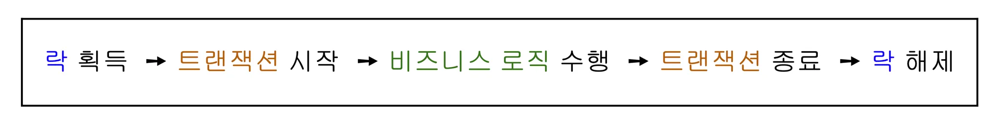
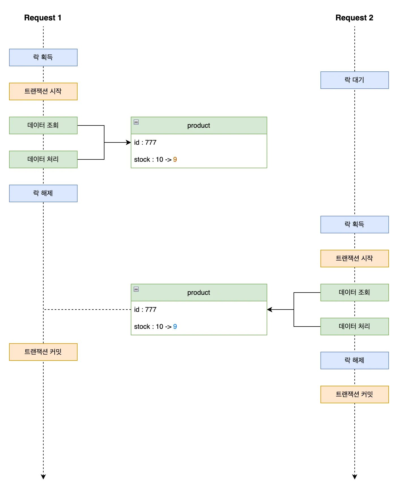

# 항해 플러스 백엔드 8기 5, 6주차 - 동시성 이슈

## 💥 동시성 이슈란? 

하나의 자원에 대해서 동시에 여러 스레드가 접근해 변경하려고 할 때 발생하는 이슈이다.   
동시성 이슈는 데이터 정합성 문제를 일으키며 디버깅이 어려워 오류 감지가 어렵다.  
그렇기 때문에 운영에서 반드시 해결해야 하는 문제이다. 

## 💎 동시성 문제 유형 

### 📌 Race Condition (경쟁 조건)

여러 작업이 동시에 실행되며 결과가 실행 순서에 따라 달라진다.

```text
두 사용자가 동시에 같은 재고를 1개 구매 시도 → 재고가 0이어야 하지만 1이 남거나 마이너스
```

### 📌 Lost Update (갱신 손실)

두 작업이 같은 데이터를 읽고 수정한 뒤, 먼저 반영된 작업이 나중에 반영된 작업에 의해 덮어쓰여지는 현상이다.

```text
A가 사용자 이름을 '철수'로 수정, B가 동시에 '영희'로 수정 → 마지막에 저장된 '영희'만 반영됨
```

이외에도, **트랜잭션 격리수준**에 따른 동시성 문제 유형이 존재한다.  
**Dirty Read, Non-Repeatable Read, Phantom Read** 등은 트랜잭션 격리수준에 따라 발생할 수 있는 문제들이다.  
자세한 내용은 [**이전 포스트**](../week4/README.md)에서 다룬다.

## ♻️ Java 동시성 해결

### 📌 synchronized 키워드

**자바 기본 동기화 키워드**로, 메서드나 코드 블럭에 락을 걸어 단일 스레드만 진입 할 수 있도록 제한한다.  
문법이 간단하고 직관적이나, 스레드 락이 풀릴 때까지 무한 대기하여 성능 저하에 영향을 끼칠 수 있고,   
공정성 보장이 되지 않아 특정 락이 오랜기간 동안 락을 획득하지 못할 수 있다. 

```java
private int count = 0;

public synchronized void increment() { // ✅ synchronized 키워드를 사용해 메서드 블록 동기화 제어
    count++;
}
```

### 📌 ReentrantLock

재진입이 가능하고 조건 제어나 타임아웃, 인터럽트를 통해 세밀하게 동기화 제어를 할 수 있는 락이다.  
**순서를 보장하는 공정성 설정이 가능**하고, 세밀하게 동기화를 제어할 수 있다. 

```java
private int count = 0;
private final ReentrantLock lock = new ReentrantLock();

public void increment() {
    lock.lock(); // ✅ ReentrantLock을 통한 락 획득
    try {
        count++;
    } finally {
        lock.unlock(); // ✅ ReentrantLock을 통한 락 해제
    }
}
```

### 📌 Atomic 클래스

CAS(Compare-And-Set) 알고리즘 기반으로 원자성을 보장하며 **락 없이 연산이 가능하다**.  
락이 없어 성능이 우수하나, 복잡한 연산에는 적합하지 않다.

```java
private AtomicInteger count = new AtomicInteger(0);

public void increment() {
    count.incrementAndGet(); // ✅ 락 없이 CAS 기반으로 원자성 연산을 한다.
}
```

## 🔒 Database 락 

Database 락은 데이터베이스에서 여러 트랜잭션이 동일한 데이터에 접근할 때 충돌을 방지해 정합성을 보장하기 위해 사용하는 락이다.

일반적으로, **쓰기 트랜잭션에는 배타 락(X-Lock)이 걸려**,  
다른 트랜잭션이 **동시에 동일한 데이터에 쓰기 작업**을 수행하지 못하도록 막는다.  

하지만 대부분 RDBMS는 MVCC를 지원하여,   
쓰기 작업 중인 데이터라도 이전 트랜잭션 기준의 값을 읽을 수 있도록 보장한다.

### 📌 낙관적 락 (Optimistic Lock)

+ 데이터 충돌이 거의 없을 것이라 가정하고, 읽기 시점에는 락을 걸지 않으며, 쓰기 시점에 버전 충돌 여부를 확인하는 방식
+ 충돌이 감지되면 예외를 발생시켜 트랜잭션을 롤백하거나 재시도해야 한다.
+ 충돌이 빈번할 경우 반복적인 실패와 재시도로 인해 성능 저하가 발생할 수 있다.

### 📌 비관적 락 (Pessimistic Lock)

+ 데이터 충돌이 자주 발생할 것으로 가정하고, 트랜잭션 시작 시점에 락을 설정하여 다른 트랜잭션의 접근을 차단하는 방식 
+ 확실한 정합성이 필요할 경우에 적합하다. 
+ 락을 유지하는 동안 다른 요청은 대기 상태가 되므로, 요청량이 많은 환경에서는 데드락이나 병목 현상이 발생할 수 있다. 

## 🧭 동시성 제어 방식을 결정하는 기준 

기능 별로 락 전략을 다르게 설정하는 것이 아닌, 동일한 자원에 대해서는 일관된 락 전략을 사용해야 한다. 
> 예 : 잔액 충전은 **낙관적 락** 잔액 차감은 **비관적 락** 을 사용하는 것이 아니라 "잔액"이라는 동일한 자원에 대해 동일한 락 전략을 적용해야 한다.

### 📌 "락 전략"을 결정하는 기준

충돌 가능성에 따라 결정할 수 있지만, 반드시 **성공해야하는 요청**이면 "**비관적 락**"을 사용해야 한다.  
그렇지 않으면 낙관적 락을 사용한다.

### 📌 "락 범위"를 결정하는 기준

락은 가능한 최소 범위로 설정해야 한다. 락 범위가 넓을 수록 성능 저하와 데드락 위험이 증가한다.

## 🧩 JPA 락 전략 설정

### 📌 @Version (낙관적 락)

엔티티 클래스의 `@Version` 어노테이션을 사용하여 버전 필드를 정의한다.   
버전 값은 트랜잭션 커밋 시 비교되어, 충돌 발생 시 `OptimisticLockingFailureException.class` 예외가 발생한다.  
예외 발생 시, `@Retryable` 어노테이션을 사용하여 재시도 로직을 구현할 수 있다.

```java

@Entity
public class Balance {

    @Id
    @GeneratedValue(strategy = GenerationType.IDENTITY)
    private Long id;

    @Version
    private Integer version; // 🔒 낙관적 락을 위한 버전 필드

    private Long userId;
    private long amount;
}
```

### 📌 @Lock (비관적 락)

`@Lock(LockModeType.PESSIMISTIC_WRITE)` 어노테이션을 사용하여 비관적 락을 설정할 수 있다.  
데이터 조회 시점부터 락을 걸어 다른 트랜잭션의 쓰기 접근을 차단한다.

```java
@Repository
public interface BalanceRepository extends JpaRepository<Balance, Long> {

    @Lock(LockModeType.PESSIMISTIC_WRITE) // 🔒 비관적 락 적용
    @Query("SELECT b FROM Balance b WHERE b.userId = :userId")
    Optional<Balance> findByUserIdWithLock(@Param("userId") Long userId);
}
```

## 💿 Redis 분산 락

Redis 분산 락은 멀티 인스턴스 환경에서 자원 접근을 제어하기 위한 동시성 제어 수단으로,  
Redis의 단일 스레드 기반 연산(`SET NX` 등)을 활용해 원자성을 보장하므로 분산 락 구현에 적합하다.

락의 안정성과 신뢰성을 높이기 위해 **분산 락 전용 Redis 인스턴스를 별도로 구성**하는 것이 권장된다.  
또한 Redis 외에도 Zookeeper, etcd 등과 같은 **분산 코디네이션 시스템**을 활용한 분산 락 방식도 존재한다.

### 📌 분산 락 순서의 중요성

분산 락과 트랜잭션은 데이터 무결성과 정합성을 보장하기 위해, 반드시 아래 순서를 지켜야 한다.  



#### 1️⃣ 문제 1. 트랜잭션이 먼저 시작된 후, 분산 락을 획득하는 경우

재고 차감 로직에서 트랜잭션이 먼저 시작된 뒤 분산 락을 획득하면,  
**조회 시점에 락이 적용되지 않아 동일한 재고 수를 여러 요청이 동시에 읽는 문제가 발생할 수 있다.**  
이는 결국 **Race Condition**을 유발하여 잘못된 재고 차감 결과를 초래할 수 있다.

또한, 락 획득에 실패하더라도 **이미 트랜잭션이 시작되어 DB 커넥션이 점유된 상태**이므로,  
락 획득 실패 후에도 **불필요한 커넥션 사용으로 DB에 부하**를 줄 수 있다.


#### 2️⃣ 문제 2. 분산 락이 먼저 해제 된 후, 트랜잭션이 커밋되는 경우

트랜잭션이 완료되기 전에 **분산 락이 먼저 해제되면**,  
다른 트랜잭션이 락을 선점하고 재고 차감을 시도할 수 있다.  
이 경우, 아직 커밋되지 않은 데이터를 조회하게 되어 **정합성이 깨질 위험**이 있다.

**즉, 트랜잭션 커밋 전에는 절대 락을 해제하면 안 된다.**  
이를 방지하기 위해서는 락 해제를 반드시 트랜잭션 종료 이후(`afterCommit`)로 미뤄야 한다.



### 🌱 Spring 분산 락 구현

Spring 에서 분산 락 구현하기 위해 아래와 같은 어노테이션과 AOP를 작성해야 한다. 

#### ✨ @DistributedLock 어노테이션

```java
@Target(ElementType.METHOD)
@Retention(RetentionPolicy.RUNTIME)
public @interface DistributedLock {

    String key(); // 분산 락을 식별할 키 (예: 쿠폰 ID)
    LockType type(); // 키 prefix 구분용 타입 (예: COUPON, PRODUCT 등)
    long waitTime() default 5L; // 락 획득을 시도할 최대 대기 시간
    long leaseTime() default 3L; // 락 소유 유지 시간 (TTL)
    TimeUnit timeUnit() default TimeUnit.SECONDS; // 시간 단위
    LockStrategy strategy() default LockStrategy.PUB_SUB_LOCK; // 사용할 분산 락 전략 
}
```

#### ✨ DistributedLockAspect AOP 클래스 

```java
@Aspect
@Order(Ordered.HIGHEST_PRECEDENCE) // 트랜잭션보다 먼저 실행되도록 설정 (락이 트랜잭션에 종속되지 않도록)
public class DistributedLockAspect {

    private final LockKeyGenerator generator;
    private final LockStrategyRegistry registry;

    @Around("@annotation(DistributedLock)")
    public Object lock(ProceedingJoinPoint joinPoint) throws Throwable {
        MethodSignature signature = (MethodSignature) joinPoint.getSignature();
        DistributedLock lock = signature.getMethod().getAnnotation(DistributedLock.class);

        // 메서드 인자 기반으로 실제 사용할 락 키 생성 
        String key = generator.generateKey(signature.getParameterNames(), joinPoint.getArgs(), lock.key(), lock.type());
        
        // 락 전략에 따른 락 템플릿 설정
        LockTemplate template = registry.getLockTemplate(lock.strategy());

        // 락을 획득한 뒤 비즈니스 로직 실행
        return template.executeWithLock(key, lock.waitTime(), lock.leaseTime(), lock.timeUnit(), joinPoint::proceed);
    }
}
```

#### ✨ LockTemplate 인터페이스

Redis 분산 락은 락 획득 방식에 따라 다양한 전략으로 구현할 수 있다.   
공통 인터페이스인 `LockTemplate`을 정의하고, 각 전략에 맞는 구현체를 작성한다.

```java
public interface LockTemplate {

    // 락을 획득하고 비즈니스 로직을 실행하는 메서드
    <T> T executeWithLock(String key, long waitTime, long leaseTime, TimeUnit timeUnit, LockCallback<T> callback) throws Throwable;

    // 락 전략을 반환
    LockStrategy getLockStrategy();

    // 락 획득
    void acquireLock(String key, long waitTime, long leaseTime, TimeUnit timeUnit) throws InterruptedException;

    // 락 해제
    void releaseLock(String key);
}
```

그리고, `LockTemplate` 인터페이스의 구현체인 `DefaultLockTemplate`에서는  
락 해제시, 트랜잭션 범위 밖에서 해제를 보장하기 위해 `TransactionSynchronizationManager`를 사용하여 트랜잭션 커밋 후에 락을 해제하도록 한다.

```java
public abstract class DefaultLockTemplate implements LockTemplate {

    @Override
    public <T> T executeWithLock(String key, long waitTime, long leaseTime, TimeUnit timeUnit, LockCallback<T> callback) throws Throwable {
        try {
            acquireLock(key, waitTime, leaseTime, timeUnit);
            return callback.doInLock();
        } finally {
            // 트랜잭션이 활성화되어 있다면, 트랜잭션 커밋 후 락을 해제하도록 한다.
            if (TransactionSynchronizationManager.isActualTransactionActive()) {
                TransactionSynchronizationManager.registerSynchronization(new TransactionSynchronization() {
                    @Override
                    public void afterCompletion(int status) {
                        releaseLock(key);
                    }
                });
            } else {
                releaseLock(key);
            }
        }
    }

    public abstract void acquireLock(String key, long waitTime, long leaseTime, TimeUnit timeUnit) throws InterruptedException;

    public abstract void releaseLock(String key);
}
```

### 🔐 분산락 종류

#### 📌 Simple Lock

가장 단순한 락 방식으로, 락 획득 실패 시 즉시 예외를 발생시킨다. 

#### 📌 Spin Lock

락 획득에 실패하더라도 일정 시간/횟수 동안 계속해서 재시도하는 방식이다.  
단순한 루프 기반 재시도이지만, 부하가 적은 환경에서는 유용하게 사용할 수 있다. 

```java
@Slf4j
@Component
@RequiredArgsConstructor
public class SpinLockTemplate extends DefaultLockTemplate {

    private static final String UNLOCK_SCRIPT = """
        if redis.call("get", KEYS[1]) == ARGV[1] then
            return redis.call("del", KEYS[1])
        else
            return 0
        end
    """;

    private final StringRedisTemplate redisTemplate;
    private final LockIdHolder lockIdHolder;

    @Override
    public LockStrategy getLockStrategy() {
        return LockStrategy.SPIN_LOCK;
    }

    @Override
    public void acquireLock(String key, long waitTime, long leaseTime, TimeUnit timeUnit) {
        long startTime = System.currentTimeMillis();
        String lockId = UUID.randomUUID().toString();

        lockIdHolder.set(key, lockId);

        log.debug("락 획득 시도 : {}", key);
        while (!tryLock(key, lockId, leaseTime, timeUnit)) {
            log.debug("락 획득 대기 중 : {}", key);

            if (timeout(startTime, waitTime, timeUnit)) {
                throw new IllegalStateException("락 획득 대기 시간 초과 : " + key);
            }

            Thread.onSpinWait();
        }
    }

    @Override
    public void releaseLock(String key) {
        if (lockIdHolder.notExists(key)) {
            log.debug("락 해제 실패 : 락을 보유하고 있지 않음 : {}", key);
            return;
        }

        String lockId = lockIdHolder.get(key);
        unlock(key, lockId);

        lockIdHolder.remove(lockId);
        log.debug("락 해제 : {}", key);
    }

    private boolean tryLock(String key, String lockId, long leaseTime, TimeUnit timeUnit) {
        return Boolean.TRUE.equals(redisTemplate.opsForValue().setIfAbsent(key, lockId, leaseTime, timeUnit));
    }

    private boolean timeout(long startTime, long waitTime, TimeUnit timeUnit) {
        return System.currentTimeMillis() - startTime > timeUnit.toMillis(waitTime);
    }

    private void unlock(String key, String lockId) {
        redisTemplate.execute(
            new DefaultRedisScript<>(UNLOCK_SCRIPT, Long.class),
            Collections.singletonList(key),
            lockId
        );
    }
}
```

#### 📌 Pub/Sub Lock

Redis의 Publish/Subscribe 기능을 활용하여, 락 해제 이벤트를 수신한 후 락 획득을 재시도하는 방식이다.    
Redisson 라이브러리 내부적으로 이 방식을 기반으로 구현되어 있다.  

```java
@Component
@RequiredArgsConstructor
public class PubSubLockTemplate extends DefaultLockTemplate {

    private final RedissonClient redissonClient;

    @Override
    public LockStrategy getLockStrategy() {
        return LockStrategy.PUB_SUB_LOCK;
    }

    @Override
    public void acquireLock(String key, long waitTime, long leaseTime, TimeUnit timeUnit) throws InterruptedException {
        RLock lock = redissonClient.getLock(key);
        log.debug("락 획득 시도 : {}", key);

        boolean acquired = lock.tryLock(waitTime, leaseTime, timeUnit);
        if (!acquired) {
            throw new IllegalStateException("락 획득 실패 : " + key);
        }
    }

    @Override
    public void releaseLock(String key) {
        RLock lock = redissonClient.getLock(key);

        if (lock.isHeldByCurrentThread()) {
            lock.unlock();
            log.debug("락 해제 : {}", key);
        }
    }
}
```

[출처]  
항해 플러스 : https://hanghae99.spartacodingclub.kr/plus/be